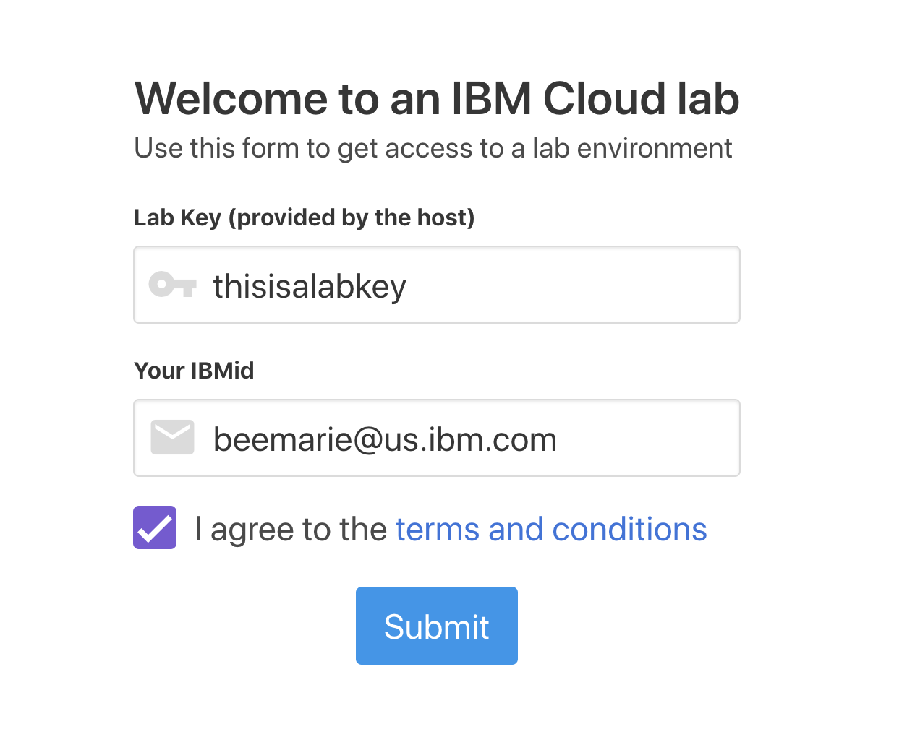
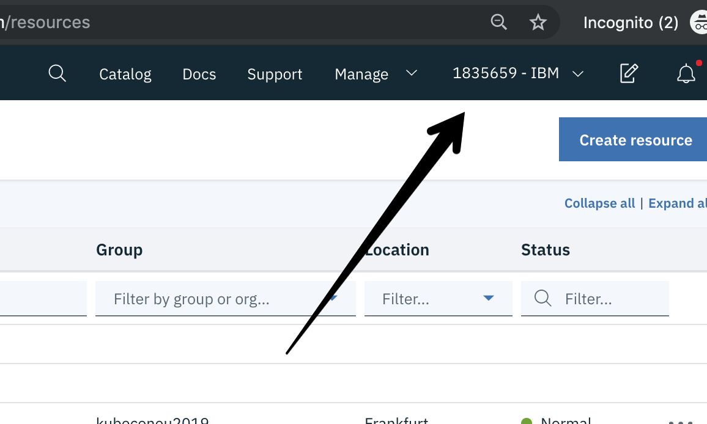

# Get Started
In this section, you will login to your own IBM Cloud account, and then get access to a IBM Cloud Lab account which contains pre-provisioned clusters. Each lab attendee will be granted access to one cluster.

1. Create your own [IBM Cloud account](https://cloud.ibm.com/registration?cm_mmc=Email_Events-_-Developer_Innovation-_-WW_WW-_-advocates:alextarpinian,nbhatia\title:kubeconsandiego-november2019\eventid:5ca3a58584ebbfb8929f3671\date:Nov2019\type:conference\team:global-devadvgrp-sanfrancisco\city:sandiego\country:unitedstates\tags:open-source,cloud,containers,continuous-delivery,continuous-integration,continuous-testing,devops,hybrid,linux,microservices,object-storage,security,spring,ibmz,ibm-linuxone\contents:kubernetes-learning-path,kabanero,kubernetes-vs-docker-its-not-an-either-or-question&cm_mmca1=000019RS&cm_mmca2=10004805&cm_mmca3=M99938765&eventid=5ca3a58584ebbfb8929f3671&cvosrc=email.Events.M99938765&cvo_campaign=000019RS)

1. After the email verification, confirm by logging in to https://cloud.ibm.com.

1. Go to [Grant Cluster](https://kubeforumsydney.mybluemix.net/) web page and enter your IBM ID (the email you used to sign up) and the lab key from the instructor

    

1. You will be added to the IBM Lab account and granted access to a cluster. Note the name of your cluster. It will be something like: `myclusterXXX`.

1. Refresh your [IBM Cloud Dashboard](https://cloud.ibm.com)

1. Switch to the **1835659-IBM** account by clicking on the account selection drop down in the top nav bar.

   

1. Click on **Clusters** in the Resource Summary tile.

    

1.  Under **Clusters**, click on the cluster that has been assigned to you.

    

1. Launch the **Kubernetes Dashboard** and have a look around! You can come back to this dashboard throughout your lab.

### [Continue to Exercise 1](/workshop/exercise-1/README.md)
