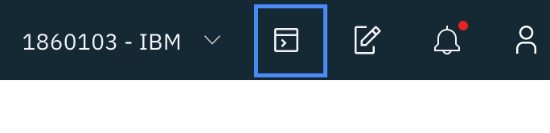

# Lab Test
## Cluster Test:
1. Go to grant clusters app: https://grant-cluster-kubeconeu.mybluemix.net/
2. Input IBM id and the Passcode `istiorocks`
3. Select Frankfurt as Region
4. Click Submit
5. Login to IBM Cloud (https://cloud.ibm.com)
6. Change Account drop down to “IBM”
    
7. Under Resource Summary click `Kubernetes Clusters`
8. Find your newly assigned cluster in the list, and click on it to see more details
9. Add Istio under the Add-Ons tab.
    
## Cloud Shell Test:
Go to cloudshell app https://ibm.biz/BdzzVC which should link to: https://cloudshell-console-ikslab.us-south.cf.cloud.ibm.com/

1. Select IBM from the account drop down
   
2. Click terminal icon in top right to load terminal
3. Run the following command:
```
ibmcloud ks cluster-config YOUR_CLUSTER_NAME_HERE
```
4. Get cluster nodes
```
kubectl get nodes
```
1. Clone sample 
```
git clone -b kubecon2019 https://github.com/IBM/guestbook
```
2. Test Grafana
```
kubectl -n istio-system port-forward \
  $(kubectl -n istio-system get pod -l app=grafana -o jsonpath='{.items[0].metadata.name}') \
  8082:3000
```
3. Click on the web preview icon and select port 8082.


