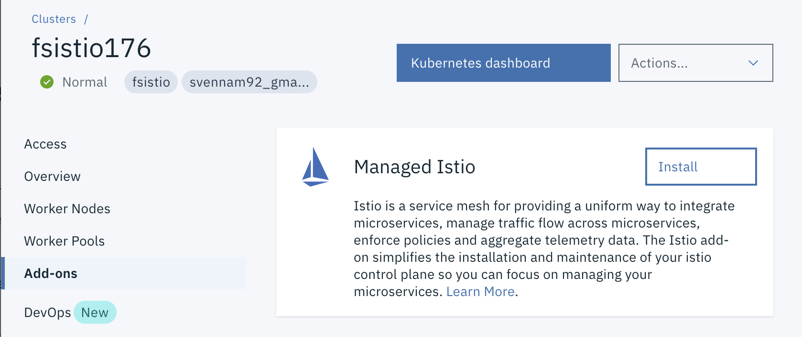

# Exercise 2 - Installing Istio on IBM Cloud Kubernetes Service

In this module, you will use the Managed Istio add-on to install Istio on your cluster. 

Managed Istio is available as part of IBM Cloud™ Kubernetes Service. The service provides seamless installation of Istio, automatic updates and lifecycle management of control plane components, and integration with platform logging and monitoring tools.
  
1.  Navigate to your cluster in the [IBM Cloud Dashboard](https://cloud.ibm.com/kubernetes/clusters), switch to the `Add-ons` tab and install Istio:



    > Remember to switch to the IBM account where the cluster exists. It can take up to 5 minutes for the install to begin.

1.  After waiting, check that the `istio-*` Kubernetes services are deployed before you continue.

    ```
    kubectl get svc -n istio-system
    ```

    Sample output:
    ```shell
    NAME                   TYPE           CLUSTER-IP       EXTERNAL-IP     PORT(S)                                                                                                                                      AGE
istio-egressgateway    ClusterIP      172.21.209.144   <none>          80/TCP,443/TCP,15443/TCP                                                                                                                     4s
istio-ingressgateway   LoadBalancer   172.21.51.220    169.60.178.59   15020:32244/TCP,80:31639/TCP,443:31363/TCP,15029:30007/TCP,15030:30227/TCP,15031:32426/TCP,15032:31808/TCP,31400:31369/TCP,15443:31486/TCP   2s
istiod                 ClusterIP      172.21.81.153    <none>          15012/TCP,443/TCP                                                                                                                            2s
    ```

    **Note: If your istio-ingressgateway service IP is `<pending>`, please check with the lab instructor before proceeding.**

1.  Ensure the corresponding pods are all in **`Running`** state before you continue.

    ```shell
    kubectl get pods -n istio-system
    ```
    Sample output:
    ```shell
    NAME                                    READY   STATUS    RESTARTS   AGE
istio-egressgateway-6c966469cc-52t6f    1/1     Running   0          69s
istio-egressgateway-6c966469cc-qq5qd    1/1     Running   0          55s
istio-ingressgateway-7698c7b4f4-69c24   1/1     Running   0          68s
istio-ingressgateway-7698c7b4f4-qttzh   1/1     Running   0          54s
istiod-cbb98c74d-2wvql                  1/1     Running   0          54s
istiod-cbb98c74d-kcr4d                  1/1     Running   0          67s
    ```

    Before you continue, make sure all the pods are deployed and either in the **`Running`** or **`Completed`** state. If they're in `pending` state, wait a few minutes to let the installation and deployment finish.

2. Check the version of your Istio:
    ```shell
    istioctl version
    ```
    Sample output:
    ```shell
    client version: 1.8.1
    control plane version: 1.8.1
    ```
Congratulations! You successfully installed Istio into your cluster.


## Install the monitoring dashboards

1. Install grafana
```
kubectl apply -f https://raw.githubusercontent.com/istio/istio/release-1.8/samples/addons/grafana.yaml

```
2. Install Jaeger
```
kubectl apply -f https://raw.githubusercontent.com/istio/istio/release-1.8/samples/addons/jaeger.yaml
```
3. Install Kiali
```
kubectl apply -f https://raw.githubusercontent.com/istio/istio/release-1.8/samples/addons/kiali.yaml
```
4. Install Prometheus
```
kubectl apply -f https://raw.githubusercontent.com/istio/istio/release-1.8/samples/addons/prometheus.yaml
```
