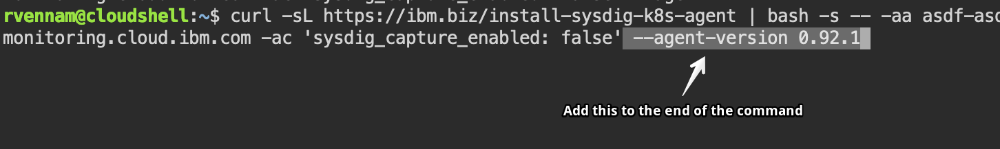
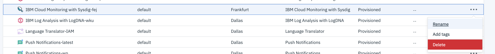

# Exercise 4 - Monitoring

<!-- ## Using IBM Log Analysis with LogDNA

IBM Log Analysis with LogDNA is a third-party service that you can include as part of your IBM Cloud architecture to add log management capabilities. IBM Log Analysis with LogDNA is operated by LogDNA in partnership with IBM.

The service plan that you choose for an IBM Log Analysis with LogDNA instance defines the number of days that data is stored and retained in LogDNA. For example, if you choose the Free plan, data is not stored at all. However, if you choose the 7 day plan, data is stored for 7 days and you have access to it through the LogDNA Web UI.

## Configure your cluster with LogDNA

1. From the [IBM Cloud Dashboard](https://cloud.ibm.com/), select your Account from the top menu bar, NOT the IBM account.
2. Create an instance of LogDNA
   1. Click on **Catalog** in the top menu bar.
   2. Search for `IBM Log Analysis with LogDNA`
   3. Select the Dallas location.
   4. Use the default resource group.
   5. Click **Create**.
3. Click **Edit log sources**:
   1. Ensure **Kubernetes** is selected as a source
   2. Run the listed commands against your Kubernetes cluster in the web terminal window.

## View logs in the LogDNA dashboard

1. On the IBM Log Analysis page, click **View LogDNA** to open the LogDNA console.
2. Generate some load on your application by visiting it in another browser window and wait 30 seconds.
3. Keep an eye on the LogDNA console for new log statements coming from your apps. Use the filters to select guestbook. Refresh the page if you do not see any filters.


Find more about IBM Log Analysis with LogDNA in the [IBM Cloud documentation](https://cloud.ibm.com/docs/services/Log-Analysis-with-LogDNA/index.html#getting-started).
 -->

## Using IBM Cloud Monitoring with Sysdig

The IBM Cloud™ Monitoring with Sysdig service is a fully managed enterprise-grade monitoring service. You get deep container visibility, service-oriented views and comprehensive metrics. You can use this to gain operational visibility for your applications, services, and platform. Sysdig offers administrators, DevOps teams and developers advanced features to monitor and troubleshoot, define alerts, and design custom views.

## Create a Sysdig service instance

1. From the [IBM Cloud Monitoring Dashboard](https://cloud.ibm.com/observe/monitoring), select *IBM* account from the top menu bar.
3. Click **Edit sources** next to any existing Sysdig instance
   1. Select **Kubernetes** as a source
   2. Copy listed command in the **Install Sysdig Agent to your cluster** section.
   3. Paste the command into your Shell and add this to the end of the command ` --agent-version 0.92.1`
   
   
Wait 10 minutes. You just installed the Sysdig monitoring agent into the cluster. The agent will start scraping metrics from Kubernetes and Istio and send it to the Sysdig backend. This process can take around 10 minutes. You can wait, or you can jump ahead to the next section and come back later.

## View SysDig Dashboard

1. Scroll down and click on **View SysDig**
2. In the Sysdig _Welcome_ wizard:
    1. Select **Kubernetes** as the installation method.
    2. After 30 seconds or so, it should show one or more agents connected.
    3. Select **GO TO NEXT STEP**.
    4. And finally **LET'S GET STARTED**
3. Navigate the Sysdig console to get metrics on your Kubernetes cluster, nodes, deployments, pods, containers. Explore the following:
   1. Under **Explore**, select **Containerized Apps** to view raw metrics for all workloads running on the cluster.
   2. Under **Dashboard**, select **My Dashboards / HTTP Overview** to get a global view of the cluster HTTP load.
   3. Under **Dashboard**, select **My Dashboards / Overview by Host** to understand how nodes are currently performing.
   4. Under **Explore** > **Cluster and Nodes** > your cluster > **Kubernetes Cluster and Node Capacity** > **Default Dashboards** > **Applications** > **Istio 1.0 Service** to get Istio specific metrics. If you don't see the dashboard yet, wait about 30 seconds and refresh the page.

Delete the SysDig instance when complete

#### [Continue to Exercise 5 - Expose the service mesh with the Istio Ingress Gateway](../exercise-5/README.md)
